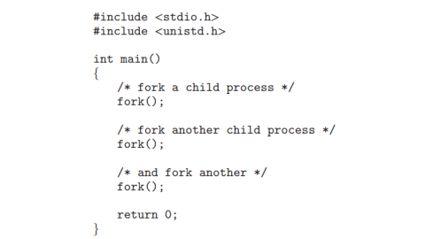

# PROBLEMA 1: ¿Incluyendo el proceso inicial, cuantos procesos son creados por el siguiente programa?, Razone su respuesta



**En resumen, al final del programa tienes 8 procesos:**

Cada llamada a fork() duplica el número de procesos activos, se crean 2^3 = 8 procesos.


## PROBLEMA 2: Utilizando un sistema Linux, escriba un programa en C que cree un proceso hijo (fork) que finalmente se convierta en un proceso zombie. Este proceso zombie debe permanecer en el sistema durante al menos 60 segundos. Los estados del proceso se pueden obtener del comando: ps -l 

```c
#include <stdio.h>
#include <stdlib.h>
#include <unistd.h>
#include <sys/types.h>
#include <sys/wait.h>

int main() {
    pid_t pid;

    pid = fork();

    if (pid == 0) {
        // proceso hijo se crea y se termina para entrar en modo zombie
        printf("Proceso hijo con PID %d ha terminado.\n", getpid());
        exit(0); 
    } else {

        printf("Proceso padre con PID %d.\n", getpid());

        // Esperar 60 seg para ver el estado zombie 
        sleep(60);

        // Eliminar el proceso zombie
        wait(NULL); // Recoger el estado del hijo
        printf("Proceso zombie con PID %d eliminado.\n", pid);
    }

    return 0;
}
```
ejecutando codigo 


procesos del sistema linux se puede ver que el proceso entro en modo zombi con el PID 142137


## PROBLEMA 3: Usando el siguiente código como referencia, completar el programa para que sea ejecutable y responder las siguientes preguntas:

**Respuesta final:**
- **Número total de procesos creados:** 6 procesos únicos.
- **Número total de hilos creados:** 1 hilo único.


**Razonamiento de las preguntas:**
- Primera llamada a fork(): crea 1 nuevo proceso (total: 2 procesos).

- Segunda llamada a fork(): se ejecuta solo por el primer hijo, lo que genera 1 proceso más (total: 3 procesos).

- Tercera llamada a fork(): se ejecuta por los 3 procesos existentes en ese momento, generando 3 procesos adicionales (total: 6 procesos).


Codigo completado y funcionando
```C
#include <stdio.h>
#include <stdlib.h>
#include <unistd.h>
#include <pthread.h>

void* thread_function(void* arg) {
    printf("Thread created\n");
    return NULL;
}

int main() {
    pid_t pid;

    pid = fork();
   
    if (pid == 0) { /* child process */
      
        fork();

        // Crear un hilo en el proceso hijo
        pthread_t thread;
        pthread_create(&thread, NULL, thread_function, NULL);
        pthread_join(thread, NULL); // Espera a que el hilo termine
    }

    fork();

    
    return 0;
}
```

salida al compilar y ejecutar codigo


