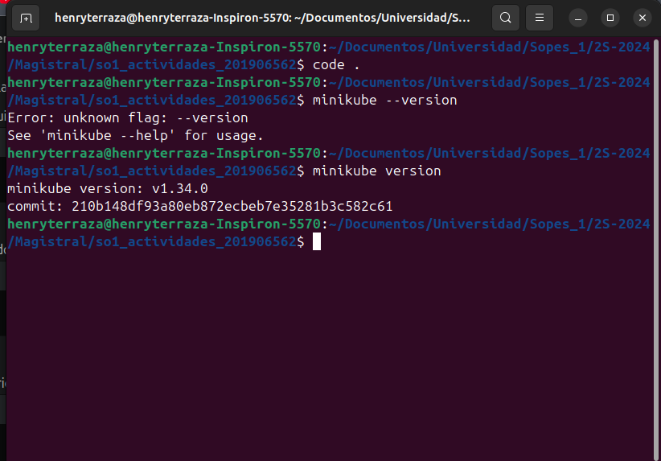

# Actividad 8

## Pasos para Instalar un Entorno Local de Kubernetes y Desplegar Nginx

1. **Desplegar un Contenedor de Nginx**

    - Version 
    

    - Status
    


4. **Desplegar un Contenedor de Nginx**
   - Crea un archivo de despliegue 
     ```yaml
    apiVersion: apps/v1
    kind: Deployment
    metadata:
    name: hola-mundo-deployment
    spec:
    selector:
        matchLabels:
        app: hola-mundo
    template:
        metadata:
        labels:
            app: hola-mundo
        spec:
        containers:
        - name: hola-mundo
            image:  hterraza/pruebapython:v1
            resources:
            limits:
                memory: "128Mi"
                cpu: "500m"
            ports:
            - containerPort: 5001

     ```
   - Aplica el despliegue usando el siguiente comando:
     ```bash
     kubectl apply -f nginx-deployment.yaml
     ```

5. **Exponer el Servicio de Nginx**
   - Crea un servicio para exponer el despliegue:
    ```yaml
    apiVersion: v1
    kind: Service
    metadata:
    name: hola-mundo-service
    spec:
    selector:
        app: hola-mundo
    ports:
    - protocol: TCP
        port: 80
        targetPort: 5001
    type: NodePort

    ```
     ```bash
      kubectl apply -f nginx-service.yaml
     ```

6. **Obtener la URL del Servicio**
   - Obtén la URL de acceso al servicio:
     ```bash
     minikube service nginx-service --url
     ```

7. **Acceder a Nginx**
   - Abre un navegador web y navega a la URL obtenida en el paso anterior para ver la página de inicio de Nginx.

   


## Respuesta a la Pregunta

**¿En un ambiente local de Kubernetes existen los nodos masters y workers, como es que esto funciona?**

En Minikube, solo hay un nodo que cumple las funciones de master y worker, lo que significa que se encarga de gestionar y ejecutar los pods al mismo tiempo. En un cluster de producción, por otro lado, hay nodos separados: los masters gestionan el estado del cluster y programan los pods, mientras que los workers son los que realmente ejecutan esos pods. Esta separación ayuda a que el sistema sea más escalable y fácil de manejar.
